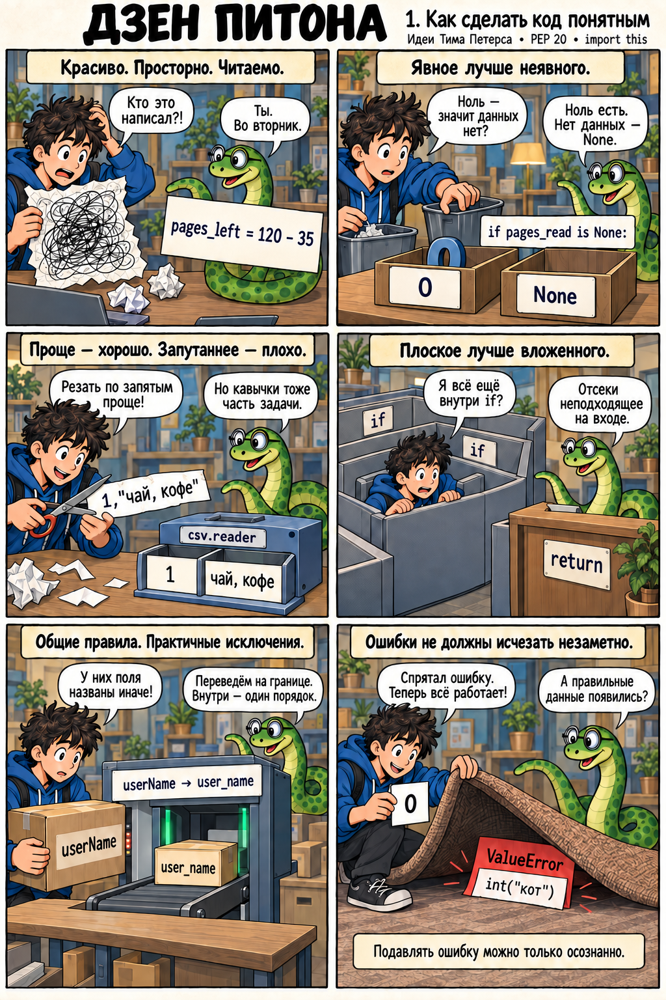
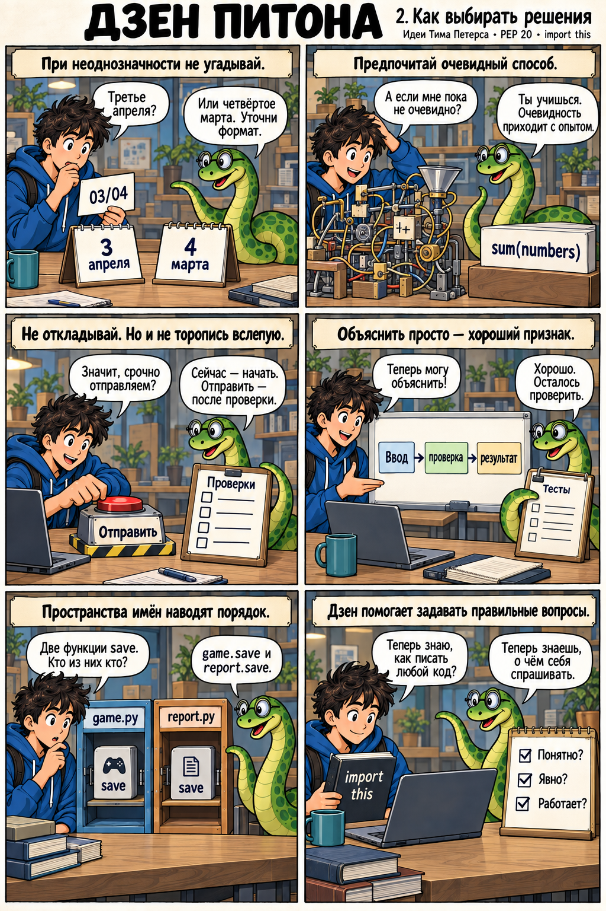

# Дзен Питона

Учебный комикс по мотивам [PEP 20 — The Zen of Python](https://peps.python.org/pep-0020/) Тима Петерса. Принципы сгруппированы по ситуациям; реплики героев — их объяснение на примерах.

## 1. Как сделать код понятным

## 2. Как выбирать решения

## Пояснения к кадрам

1. **Красота, простор и читаемость.** Осмысленные имена и понятная запись помогают вернуться к собственному коду.
2. **Явное лучше неявного.** Если отсутствие данных обозначено `None`, проверка `is None` сохраняет допустимый числовой ноль.
3. **Простое лучше сложного; сложное лучше запутанного.** Формат CSV требует учитывать кавычки. Готовый парсер скрывает эту сложность за понятным интерфейсом.
4. **Плоское лучше вложенного.** Ранний выход может убрать лишние уровни условий. Полезная вложенность остаётся допустимой.
5. **Общие правила и практичность.** Адаптер позволяет принять чужой формат и сохранить единые соглашения внутри программы.
6. **Ошибки и намеренное подавление.** Молчаливая подмена неверного числа нулём теряет информацию. Для отсутствующего необязательного файла настроек можно явно предусмотреть значения по умолчанию.
7. **Неоднозначность.** Формат даты нужно определить в требованиях или уточнить у пользователя.
8. **Очевидный способ.** Знакомые средства вроде `sum` облегчают чтение. Оговорка о неочевидности в оригинале сформулирована шуткой про голландца; в комиксе акцент сделан на опыте читателя.
9. **Сейчас или позже.** Начинать работу полезно; поспешное решение может причинить больше вреда, чем отсрочка.
10. **Объяснимость.** Трудное объяснение — повод пересмотреть решение. Простое объяснение ещё требует проверки результата.
11. **Пространства имён.** В двух модулях проекта могут существовать свои функции `save`: `game.save` и `report.save`.
12. **Применение принципов.** Zen помогает обсуждать решения с учётом задачи. Проверять их поведение всё равно нужно.

[Промпты генерации и исправления подписей](zen-of-python-comic.prompts.md).

