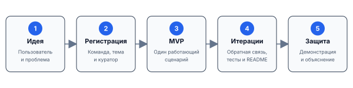

# Групповой проект: от идеи до защиты

Организационные материалы, перенесённые из лекции 4. Правила команды, регистрация, контрольные точки, помощь и защита собраны здесь.

## Как будет устроена проектная работа

Проект — это ограниченная учебная работа с четырьмя признаками:

- есть **конкретный результат**, который можно запустить и показать;
- есть **конечный план работ**, составленный самой командой;
- есть **ограниченные рамки курса**, поэтому объём приходится выбирать;
- есть **заинтересованные стороны**: пользователи, команда, куратор и преподаватель.

Процесс идёт от проблемы к работающей демонстрации, а не от длинного списка библиотек.

## Базовые правила проекта

- В команде **от 2 до 4 человек**.
- Проект должен быть **работоспособным**: основной сценарий запускается на защите.
- Каждый участник должен внести значимый вклад и понимать, как устроен весь проект, даже если ответственность разделена по модулям.
- Если хотя бы один участник не может объяснить задачу, основной сценарий, архитектуру и свой вклад, проект получает незачёт для всей команды.
- Результат должен демонстрировать осмысленное применение Python, библиотек или изученных конструкций.
- Уникальна не обязательно технология сама по себе, а комбинация **предметной задачи и технического решения**. Несколько команд могут использовать FastAPI, но не должны делать один и тот же проект.
- Тема должна быть достаточно интересна команде, чтобы довести её до работающего состояния.

Количество библиотек не является мерой качества. Маленькое законченное приложение лучше набора не связанных между собой интеграций.

## Что регистрирует команда

Конкретная задача выбирается из предложенного списка или отдельно согласуется с преподавателем. Организационный канал регистрации будет объявлен отдельно. В записи о проекте должны быть:

| Поле | Что написать |
| --- | --- |
| Состав | имена 2–4 участников |
| Рабочее название | короткое имя, которое можно изменить позднее |
| Предметная область | где возникает задача |
| Пользователь и проблема | кому и какое действие хотим упростить |
| Ожидаемый результат | что именно запустим и покажем |
| Технологии | предварительный, а не окончательный набор |
| Куратор | преподаватель или ассистент, с которым согласуются контрольные точки |

Межгрупповая команда возможна после организационного согласования. Состав, идея и куратор фиксируются до основной разработки, но технические детали можно уточнять по мере появления работающего прототипа.

## Кто за что отвечает

| Роль | Ответственность |
| --- | --- |
| Команда | выбрать объём, составить план, писать и проверять код, вести репозиторий, демонстрировать результат |
| Куратор | обсуждать постановку, помогать сузить объём, давать обратную связь на контрольных точках |
| Преподаватель | согласовать общие правила, требования и формат итоговой защиты |
| Пользователь | дать контекст задачи и, когда возможно, проверить основной сценарий |

Куратор помогает принять решение, но не проектирует и не пишет приложение вместо команды. Если совет куратора непонятен, команда должна переспросить и зафиксировать принятое решение в issue, README или короткой заметке.

## Проект начинается не с фреймворка

Слабая постановка: «сделаем бота с ИИ и базой данных». Она перечисляет технологии, но не объясняет ценность.

Рабочая постановка отвечает на вопросы:

1. кто конкретно пользуется результатом;
2. какое действие сейчас долго, дорого или неудобно;
3. какие данные доступны;
4. что приложение показывает или изменяет;
5. как проверить успех на демонстрации;
6. что не входит в первую версию.

Технологии выбирают после этого — по требованиям задачи.

## Фильтр проектной идеи

Оцените кандидатную идею по пяти вопросам:

| Вопрос | Хороший признак | Риск |
| --- | --- | --- |
| Есть пользователь? | можно назвать роль и действие | «полезно всем» |
| Есть данные? | формат и источник понятны | данные обещаны когда-нибудь |
| Есть предметное ядро? | правило или алгоритм можно проверить отдельно | вся работа — внешний API |
| Есть демонстрация? | виден вход, действие и результат | успех нельзя наблюдать |
| Помещается в курс? | минимальная версия мала | обязательны десять интеграций |

Лучше маленькое законченное ядро с ясным расширением, чем большой список технологий без работающего сценария.

## Минимальная демонстрируемая версия

MVP курса — не «плохая версия продукта», а минимальный вертикальный сценарий, который проходит через всё приложение:

`реальный вход → проверка → предметное действие → наблюдаемый результат`.

Сначала достаточно одного типа пользователя, одного сценария и небольшого набора данных. После работающего вертикального среза можно добавлять интерфейсы, хранение, конкурентность и поставку.

## Этапы без привязки к датам

Календарные сроки публикуются отдельно. Здесь фиксируем последовательность и результат каждого этапа:

| Этап | Наблюдаемый результат |
| --- | --- |
| Идея и регистрация | состав команды, пользователь, проблема, границы первой версии и куратор |
| Предметное ядро | функции или классы с проверяемыми правилами, первый сквозной сценарий |
| Архитектура и качество | модули, аннотации, тесты, конфигурация и обработка ошибок |
| Алгоритмическая часть | обоснованный алгоритм или структура данных и оценка сложности |
| Интерфейсы и хранение | только действительно нужные API, бот, UI, файлы или база данных |
| Поставка и защита | воспроизводимый запуск, README, демонстрация и ответы команды |

Этап не требует «закончить весь проект». Он требует показать конкретный артефакт, получить обратную связь и обновить следующий короткий план.

## Первая контрольная точка

После занятия 4 группа готовит:

- выбранную предметную область и краткую постановку задачи;
- пользователя, вход, выход и критерий успеха;
- границы первой версии;
- состав команды и первоначальное распределение ответственности;
- репозиторий с README;
- короткий план ближайших работ.

Фреймворк, база данных и облачный деплой пока не обязательны. Решения можно пересматривать, когда требования становятся яснее.

## Как устроена помощь

На занятиях разбираются общие принципы и базовые технологии курса. Куратор помогает с постановкой, декомпозицией, архитектурой и конкретными препятствиями. Для полезного вопроса команда приносит:

1. ожидаемое поведение;
2. минимальный воспроизводимый пример;
3. фактический результат или текст ошибки;
4. уже проверенные гипотезы.

Экзотическую библиотеку или сервис можно выбрать после согласования, но пошаговая экспертиза по любому внешнему инструменту не гарантируется. Риск такой технологии входит в план команды: должен существовать упрощённый путь к работающей демонстрации.

## Когда проект можно считать готовым

Перед защитой команда проверяет не число реализованных функций, а готовность результата:

- основной пользовательский сценарий работает от входа до результата;
- проект запускается по инструкции в чистом окружении;
- предметное ядро отделено от внешних интерфейсов;
- существенные правила покрыты автоматическими тестами;
- ошибки внешних систем обрабатываются явно;
- README объясняет задачу, архитектуру, установку и запуск;
- секреты и персональные данные не лежат в репозитории;
- каждый участник может объяснить архитектуру и свой вклад.

Если без автора проект невозможно запустить, он ещё не готов, даже если однажды работал на его ноутбуке.

## Что показывает команда на защите

Хорошая защита строится вокруг одного связного сценария:

1. назвать пользователя и проблему;
2. запустить проект по записанной инструкции;
3. показать основной вход, действие и результат;
4. объяснить архитектуру без перечисления каждого файла;
5. разобрать одно содержательное техническое решение и его альтернативы;
6. честно назвать ограничения и следующий возможный шаг;
7. ответить на вопросы о коде и вкладе участников.

Записанное видео можно иметь как резерв на случай внешнего сбоя, но оно не заменяет работоспособный проект и понимание кода.

## Как проект связан с оценкой

Проект формирует **40% оценки за семинары**. Сама оценка за семинары имеет вес 0,6 в итоговой оценке курса.

При разборе проекта важны:

- соответствие результата заявленной задаче;
- работоспособность и воспроизводимость;
- качество предметного ядра, тестов и обработки ошибок;
- обоснованность технологий и алгоритмов;
- понимание проекта всеми участниками;
- ясность демонстрации и документации.

Само по себе количество фреймворков, API или строк кода дополнительных баллов не создаёт. Если хотя бы один участник не понимает, что сделала группа, $O_{\text{проект}} = 0$ для всей команды.

## Связанные материалы

- [Git и структура Python-проекта](python-project.ipynb).
- [Дополнительные упражнения](python-project-tasks.md).
- [Справочные материалы](README.md).
- [Программа курса и правила оценки](../COURSE_PLAN.md).
